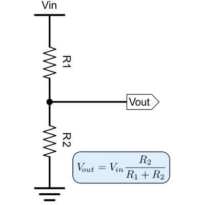

## Introduction

This tutorial will teach readers how to use ESP32's ADC pins to measure a battery's charge. Since the ADC pins can take in a max of 3.3V, we will be covering how to implement a voltage divider to lower the maximum voltage of a battery to an amount allowed by the ESP32. For the coding section, we will use the Arduino IDE to write code that will read, display, and convert the battery readings to a charge percentage using a function.

### Learning Objectives

- Voltage Dividers
- ESP32 ADC/GPIO Pins
- Arduino C
- Battery Charge State

### Background Information

A battery indicator circuit measures the state of charge (SoC) of a battery and visually outputs whether the battery’s capacity is low or full. These circuits are commonly used in battery management systems, smartphones, and other consumer electronics.

Pros:
1. Provides real-time feedback on battery life.
2. Prevents damage to the battery by avoiding overcharging or over-discharging.
3. Offers insights to maximize battery life and performance.

Cons:

1. The more complex the circuit, the higher the cost (e.g., precise resistors may be required).
2. Limited accuracy, as voltage alone isn’t the only factor that determines the charge state.

Key Concepts:

1. Voltage Divider
2. Resistor Ratios with Multiple Batteries
3. Arduino Basics

## Getting Started

You will receive an ESP32 board and USB-C to USB-C connector cable. The ESP32 is (INSERT BASIC DESCRIPTION HERE). We will be using it very simply, you do not need to understand everything it can do for this tutorial.

You will also receive a breadboard, jumper cables, and resistors. The rows of the breadboard are connected while the columns are not. The resistors and jumper cables should fit snuggly into the holes of the breadboard. 

We will be using the Arduino IDE (Integrated Development Environment). This is a free, open source program that allows users to write code and upload it to boards. 

### Required Downloads and Installations

If you don't have the Arduino IDE already, download it <a href="https://www.arduino.cc/en/software"><here>here.</a>

### Required Components

List your required hardware components and the quantities here.

| Component Name | Quanitity |
| -------------- | --------- |
|     ESP32      |     1     |
|Resistors (47kΩ)|     2     |
| 18650 Battery  |     1     |
| Battery Holder |     1     |
|Mini Breadboard |     1     |
| Jumper Cables  |     2     |

### Required Tools and Equipment

Computer, Arduino IDE

## Part 01: Setting up the Circuit

### Introduction

In this section, we will be discussing the voltage divider and circuit setup. We will not be writing any code, so a computer is not needed yet.

### Objective

- Understand how to pick values for a voltage divider.
- Understand how to properly connect the battery, resistors, and ESP32.

### Background Information

Give a brief explanation of the technical skills learned/needed
in this challenge. There is no need to go into detail as a
separation document should be prepared to explain more in depth
about the technical skills

If you've taken a look at the battery we gave you, you might notice that it says 3.7V on it. The maximum voltage input for the ESP32 is 3.3V, so we need to find a way to decrease the voltage from the battery, we can do this with a <b>voltage divider</b>.

A voltage divider is a passive linear circuit made up of two resistors, although sometimes more are used to get a specific resistance value. 
 

We have given you two 47kΩ resistors, so the output voltage will be 3.7V * 47kΩ/(47kΩ + 47kΩ) = 1.85V. 

Notice that our voltage divider halves the input voltage. To combat this division, we will need to remember to multiply our measured voltage by 2 (the reciprocal).

### Components

- Breadboard
- Battery and Battery Holder
- Resistors
- ESP32
- Jumper Cables

### Instructional

Assemble the circuit as shown in the below image. 
 </img>
Make sure to attach the cathode of the battery to the voltage divider *AND* to the ground pin of the ESP32!

## Part 02: Writing the Code

### Introduction

In this section, we will be discussing the code used to measure the battery's percentage. 

### Objective

- Understand the Arduino interface.
- Understand how to assign pin numbers in Arduino.
- Understand how to implement functions in Arduino.

### Background Information

Give a brief explanation of the technical skills learned/needed
in this challenge. There is no need to go into detail as a
separation document should be prepared to explain more in depth
about the technical skills

### Components

- ESP32
- USB-C to USB-C Connector cable for ESP32
- Your Computer

### Instructional

Teach the contents of this section

<pre><code class = "language-arduino"> //Constants
  const int batteryPin = 1;
  const float referenceVoltage = 3.3;
  const int resolution = 3950;
  const float voltageDividerRatio = 2.0;
  const float maxBatt = 4.2;
  const float minBatt = 3;
</code></pre>

<pre><code class = "language-arduino"> //Function to calculate battery voltage
  float readBatteryVoltage() {
    int rawADC = analogRead(batteryPin);
    float voltageAtPin = (rawADC/(float)resolution) * referenceVoltage;
    float batteryVoltage = voltageAtPin * voltageDividerRatio;
    return batteryVoltage;
  }
</code></pre>

<pre><code class = "language-arduino"> //setup
  void setup() {
    Serial.begin(115200);
    pinMode(batteryPin, INPUT);
  }
</code></pre>

<pre><code class = "language-C"> //loop
  void loop() {
    float batteryVoltage = readBatteryVoltage();
    Serial.print("Battery Voltage: ");
    Serial.print(batteryVoltage);
    Serial.println(" V");

    int battPercent = ((batteryVoltage-minBatt)/(maxBatt-minBatt))*100;
    Serial.print("Battery Percentage: ");
    Serial.print(battPercent);
    Serial.println(" %");

    delay(10000);
  }
</code></pre>

## Example

### Introduction

 </img>
It should look like the image above

### Example

Present the example here. Include visuals to help better understanding

### Analysis

Explain how the example used your tutorial topic. Give in-depth analysis of each part and show your understanding of the tutorial topic

## Challenge Questions

How would this change if we were using a 4.2V 18650 battery? Would you need to change either of the values of the voltage divider or just the code? 

What about a 12V battery?

### Challenge Answers

We would not need to change the voltage divider for a 4.2V battery because 4.2V/2 is 2.1V, which is under the maximum that the board can take in. We would only need to change the minBatt and maxBatt values in the code.

We would need to change the voltage divider for a 12V battery because 12V/2 is 6V, which is nearly double what the board can take in! We could choose R1 = 300kΩ and R2 = 100kΩ to get 1/4 of 12V, or 3V. We would have to change our maxBatt, minBatt, *and VoltageDividerRatio* in the code.

## Additional Resources

### Useful links

<a href="https://www.monolithicpower.com/learning/resources/an-introduction-to-batteries-components-parameters-types-and-chargers"><here>Website that tells the nominal voltage and voltage range of many batteries.</a>
